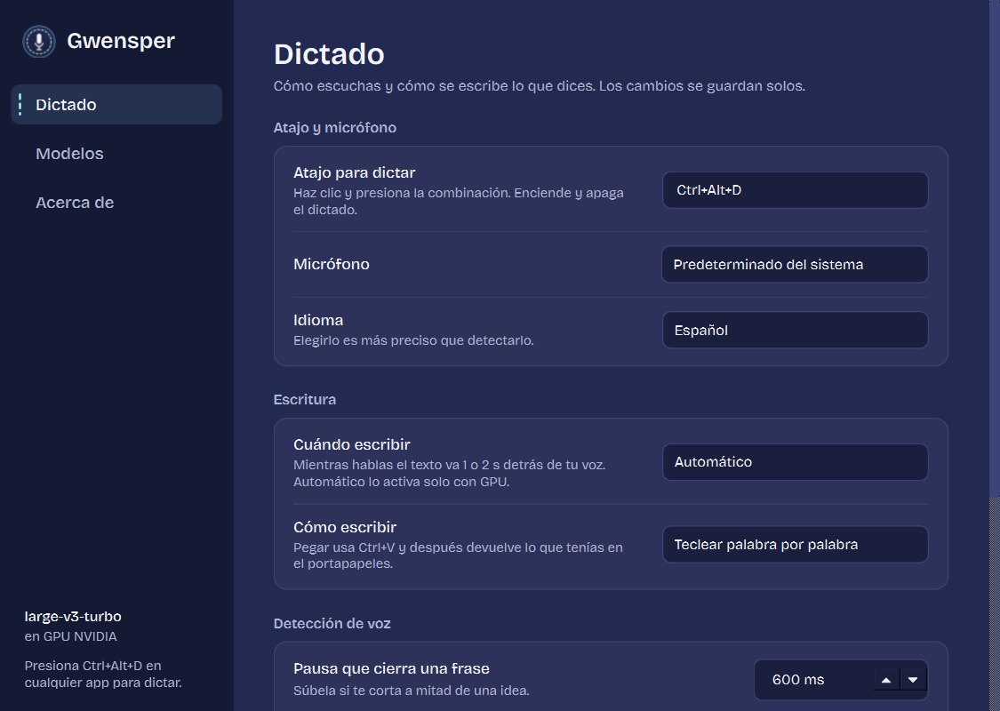
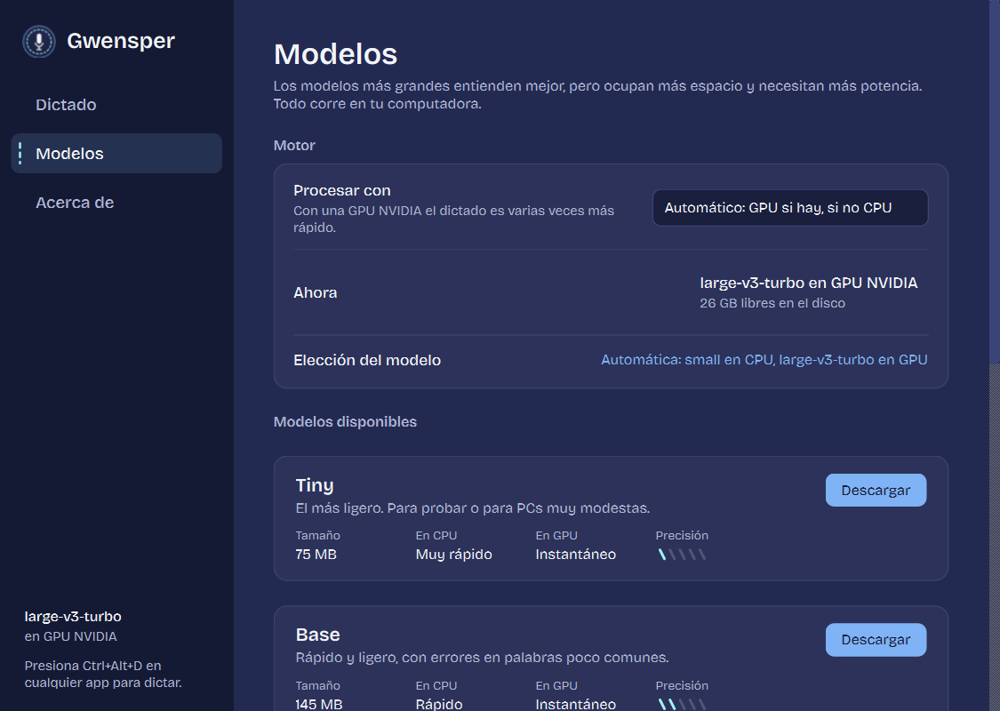

# Gwensper

Dictado por voz para Windows con [Whisper](https://github.com/openai/whisper). Presiona un atajo, habla, y lo que dices se va escribiendo en la app donde tengas el cursor: el navegador, Word, WhatsApp, VS Code o cualquier otra.

Todo corre en tu computadora: el audio no sale de tu PC.



## Cómo funciona

1. Instálalo (ver abajo) y ábrelo desde el menú Inicio. Se abre su ventana y queda un icono en la bandeja del sistema.
2. Pon el cursor donde quieras escribir y presiona **Ctrl+Alt+D**. Aparece un pequeño indicador flotante.
3. Habla. Con GPU, las palabras se escriben mientras hablas, 1 o 2 segundos detrás de tu voz. En CPU, cada frase se escribe al hacer una pausa.
4. Presiona **Ctrl+Alt+D** otra vez para detener. El indicador desaparece en cuanto se escribe lo último que dijiste.

El indicador no roba el foco: puedes hacer clic en él para detener el dictado y seguir escribiendo donde estabas. Se puede arrastrar a cualquier parte de la pantalla, y con clic derecho abres el menú.


| Estado | Qué ves |
| --- | --- |
| Escuchando | La puntada recorre el borde, más rápido cuanto más fuerte hablas, y unas tijeras cortan despacio |
| Procesando una frase | Las tijeras cortan más rápido |
| Descargando el modelo | Un hilo dorado va cosiendo el borde según el progreso |
| Error | El borde se vuelve rosa y el mensaje dice qué pasó, por ejemplo «Micrófono no disponible» |

## Instalación

**[⬇ Descargar el instalador (Instalar-Gwensper.bat)](https://github.com/whosluisnoris/gwensper/releases/latest/download/Instalar-Gwensper.bat)**

Dale doble clic y listo. No necesitas Python ni descargar el repositorio: el instalador instala lo que falte, descarga el modelo de voz, crea el acceso directo en el menú Inicio y registra Gwensper en «Aplicaciones instaladas», desde donde también se desinstala. Si tienes una tarjeta gráfica NVIDIA, instala la aceleración para usarla.

Windows mostrará el aviso «Windows protegió tu PC»: haz clic en **Más información → Ejecutar de todas formas**.

Paso a paso, requisitos, cómo actualizar y solución de problemas: **[Guía de instalación](docs/INSTALACION.md)**.

<details>
<summary>Instalación avanzada con pip</summary>

Con Python 3.10–3.13 de 64 bits:

```powershell
pip install https://github.com/whosluisnoris/gwensper/archive/refs/heads/main.zip
gwensper
```

Con GPU NVIDIA, agrega el extra `cuda` (cuBLAS y cuDNN):

```powershell
pip install "gwensper[cuda] @ https://github.com/whosluisnoris/gwensper/archive/refs/heads/main.zip"
```

Si ya tienes PyTorch con CUDA, no hace falta el extra: Gwensper usa esas mismas librerías. Si algo falla con la GPU, usa la CPU automáticamente. Si el comando `gwensper` no se reconoce, usa `python -m gwensper`.

</details>

## La ventana principal

Se abre al iniciar Gwensper, al hacer clic en el icono de la bandeja o al volver a abrirlo desde Inicio. Al cerrarla, Gwensper sigue funcionando en la bandeja. Los cambios se guardan solos.

### Dictado

| Opción | Por defecto | Para qué sirve |
| --- | --- | --- |
| Atajo para dictar | Ctrl+Alt+D | Haz clic en el campo y presiona la combinación que quieras |
| Micrófono | El del sistema | Cualquier micrófono conectado |
| Idioma | Español | O detección automática |
| Cuándo escribir | Automático | «Mientras hablo» transcribe en vivo (ideal con GPU); «Al terminar cada frase» espera a cada pausa. Automático usa el modo en vivo solo con GPU |
| Cómo escribir | Teclear palabra por palabra | «Pegar» usa Ctrl+V con la frase completa y después devuelve lo que tenías en el portapapeles |
| Pausa que cierra una frase | 600 ms | Súbela si te corta a mitad de una idea |
| Umbral de voz | 3.0 | Súbelo si el ruido de fondo se transcribe |
| Mostrar siempre el indicador | No | Si no, el indicador solo aparece mientras dictas |
| Iniciar con Windows | No | Arranca en segundo plano, directo en la bandeja |

### Modelos



Aquí eliges si procesar con GPU o CPU, ves qué modelo está en uso y cuánto espacio libre te queda, y descargas, usas o eliminas modelos:

| Modelo | Tamaño | Ideal para |
| --- | --- | --- |
| Tiny | 75 MB | Probar, o PCs muy modestas |
| Base | 145 MB | PCs modestas |
| Small | 480 MB | Dictar en CPU (el automático sin GPU) |
| Medium | 1.5 GB | Más precisión, mejor con GPU |
| Large v3 Turbo | 1.6 GB | El recomendado con GPU (el automático con GPU) |
| Large v3 | 3.1 GB | Máxima precisión, necesita una GPU con memoria |

Por defecto, el modelo se elige solo según tengas GPU o no. Al pulsar **Usar** en otro, queda fijo; el enlace «Volver a elegir automáticamente» deshace esa elección.

### Archivos

La configuración (`config.json`) y el registro (`gwensper.log`) se guardan en `%APPDATA%\Gwensper`. Si usas Python de la Microsoft Store, Windows redirige esa carpeta a `%LOCALAPPDATA%\Packages\PythonSoftwareFoundation.Python…\LocalCache\Roaming\Gwensper`. En cualquier caso, **Acerca de → Abrir carpeta de configuración** te lleva directo. Los modelos se guardan en la caché de Hugging Face (`%USERPROFILE%\.cache\huggingface`).

## Línea de comandos

```text
gwensper                       abre la app (o su ventana, si ya está abierta)
gwensper --background          abre la app en la bandeja, sin la ventana
gwensper --install-shortcut    crea el acceso directo en el menú Inicio
gwensper --uninstall-shortcut  quita los accesos directos
gwensper --test-audio a.wav    dicta un archivo como si fuera el micrófono
```

## Desarrollo

```powershell
git clone https://github.com/whosluisnoris/gwensper
cd gwensper
pip install -e ".[dev]"
pytest
python scripts/preview_overlay.py   # regenera docs/estados.png
python scripts/preview_window.py    # regenera las capturas de la ventana
python scripts/make_icon.py         # regenera el icono
```

Estructura:

```text
src/gwensper/
  app.py          orquesta micrófono → frases → Whisper → escritura
  segmenter.py    corta el audio en frases usando las pausas
  streaming.py    dictado en vivo: confirma las palabras en las que coinciden dos pasadas
  transcriber.py  faster-whisper con GPU o CPU
  typer.py        escribe en la ventana activa, palabra por palabra
  overlay.py      indicador flotante
  window.py       ventana principal: configuración y modelos
  models.py       catálogo de modelos: descargar y eliminar
  hotkey.py       atajo global (RegisterHotKey)
install/
  install.ps1             instalador (Python, entorno, librerías, modelo, accesos directos)
  Instalar-Gwensper.bat   lo que se descarga desde Releases: baja y ejecuta install.ps1
```

## Créditos

- Transcripción con [faster-whisper](https://github.com/SYSTRAN/faster-whisper), basado en [Whisper de OpenAI](https://github.com/openai/whisper).
- Fuente [Bricolage Grotesque](https://fonts.google.com/specimen/Bricolage+Grotesque), bajo la SIL Open Font License.
- La estética es un homenaje de fan a Gwen, de *League of Legends*. Gwensper no está afiliado ni respaldado por Riot Games.

## Licencia

[MIT](LICENSE)
