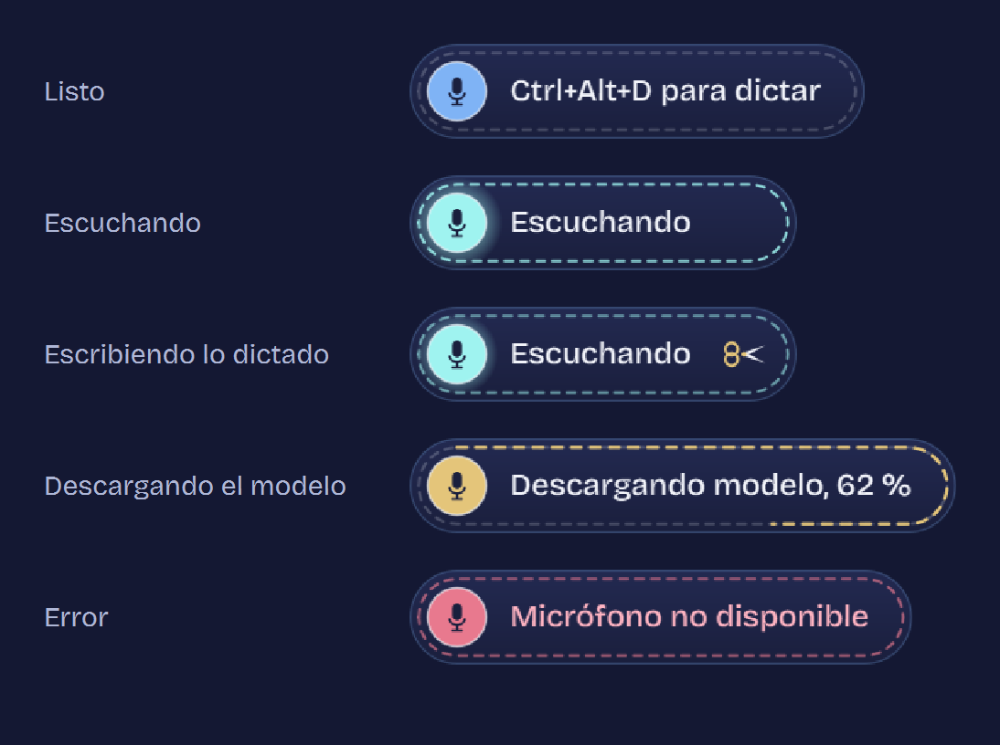

# Gwensper

Dictado por voz para Windows con [Whisper](https://github.com/openai/whisper). Presiona un atajo, habla, y lo que dices se va escribiendo frase por frase en la app donde tengas el cursor: el navegador, Word, WhatsApp, VS Code o cualquier otra.

Todo corre en tu computadora: el audio no sale de tu PC.



## Cómo funciona

1. Abre Gwensper. Aparece un pequeño parche flotante y un icono en la bandeja del sistema.
2. Pon el cursor donde quieras escribir y presiona **Ctrl+Alt+D**.
3. Habla. Cada vez que haces una pausa, la frase se transcribe y se escribe sola.
4. Presiona **Ctrl+Alt+D** otra vez para detener.

El indicador no roba el foco: puedes hacer clic en él para activar o detener el dictado y seguir escribiendo donde estabas. Se puede arrastrar a cualquier parte de la pantalla, y con clic derecho abres el menú.

| Estado | Qué ves |
| --- | --- |
| Listo | Puntadas quietas y el atajo para empezar |
| Escuchando | La puntada recorre el borde, más rápido cuanto más fuerte hablas |
| Escribiendo | Unas tijeras cortan la frase que se está transcribiendo |
| Descargando el modelo | Un hilo dorado va cosiendo el borde según el progreso |

## Instalación

Necesitas **Windows 10 u 11** y **Python 3.10 o superior** ([python.org](https://www.python.org/downloads/) o Microsoft Store).

### En cualquier PC (CPU)

```powershell
pip install git+https://github.com/whosluisnoris/gwensper
gwensper
```

La primera vez, Gwensper descarga el modelo de voz (unos 480 MB para `small`), crea un acceso directo en el menú Inicio y te avisa desde la bandeja cuando está listo. Después puedes abrirlo buscando **Gwensper** en Inicio.

### Con GPU NVIDIA (opcional, mucho más rápido)

```powershell
pip install "gwensper[cuda] @ git+https://github.com/whosluisnoris/gwensper"
```

El extra `cuda` instala cuBLAS y cuDNN. Si ya tienes PyTorch con CUDA instalado, no hace falta: Gwensper usa esas mismas librerías. Con GPU, el modelo por defecto es `large-v3-turbo`, más preciso. Si algo falla con la GPU, Gwensper usa la CPU automáticamente.

> Si el comando `gwensper` no se reconoce, la carpeta de scripts de Python no está en tu PATH. Usa `python -m gwensper` o `python -m gwensper --install-shortcut` para crear el acceso directo en el menú Inicio.

## Configuración

Clic derecho en el indicador o en el icono de la bandeja → **Configuración…**

| Opción | Por defecto | Para qué sirve |
| --- | --- | --- |
| Atajo para dictar | `ctrl+alt+d` | Cualquier combinación con ctrl, alt, shift o win, o una tecla de función (`f9`) |
| Idioma | Español | O detección automática |
| Procesar con | Automático | GPU si hay una NVIDIA, si no CPU |
| Modelo | Automático | `small` en CPU y `large-v3-turbo` en GPU. `base` o `tiny` para PCs modestos |
| Pausa que cierra una frase | 600 ms | Súbela si te corta a mitad de frase |
| Umbral de voz | 3.0 | Súbelo si el ruido de fondo se transcribe |
| Cómo escribir | Teclear | «Pegar» usa Ctrl+V y después restaura tu portapapeles |

La configuración (`config.json`) y el registro (`gwensper.log`) se guardan en `%APPDATA%\Gwensper`. Si usas Python de la Microsoft Store, Windows redirige esa carpeta a `%LOCALAPPDATA%\Packages\PythonSoftwareFoundation.Python…\LocalCache\Roaming\Gwensper`. En cualquier caso, desde el menú de la bandeja → **Abrir carpeta de configuración** llegas directo.

Desde el menú de la bandeja también puedes activar **Iniciar con Windows**.

## Línea de comandos

```text
gwensper                       abre la app (o muestra el indicador si ya está abierta)
gwensper --install-shortcut    crea el acceso directo en el menú Inicio
gwensper --uninstall-shortcut  quita los accesos directos
gwensper --test-audio a.wav    dicta un archivo como si fuera el micrófono
```

## Desarrollo

```powershell
git clone https://github.com/whosluisnoris/gwensper
cd gwensper
pip install -e ".[dev]"
pytest
python scripts/preview_overlay.py   # regenera docs/estados.png
python scripts/make_icon.py         # regenera el icono
```

Estructura:

```text
src/gwensper/
  app.py          orquesta micrófono → frases → Whisper → escritura
  segmenter.py    corta el audio en frases usando las pausas
  transcriber.py  faster-whisper con GPU o CPU
  typer.py        escribe en la ventana activa (SendInput unicode o pegar)
  overlay.py      indicador flotante
  hotkey.py       atajo global (RegisterHotKey)
```

## Créditos

- Transcripción con [faster-whisper](https://github.com/SYSTRAN/faster-whisper), basado en [Whisper de OpenAI](https://github.com/openai/whisper).
- La estética es un homenaje de fan a Gwen, de *League of Legends*. Gwensper no está afiliado ni respaldado por Riot Games.

## Licencia

[MIT](LICENSE)
